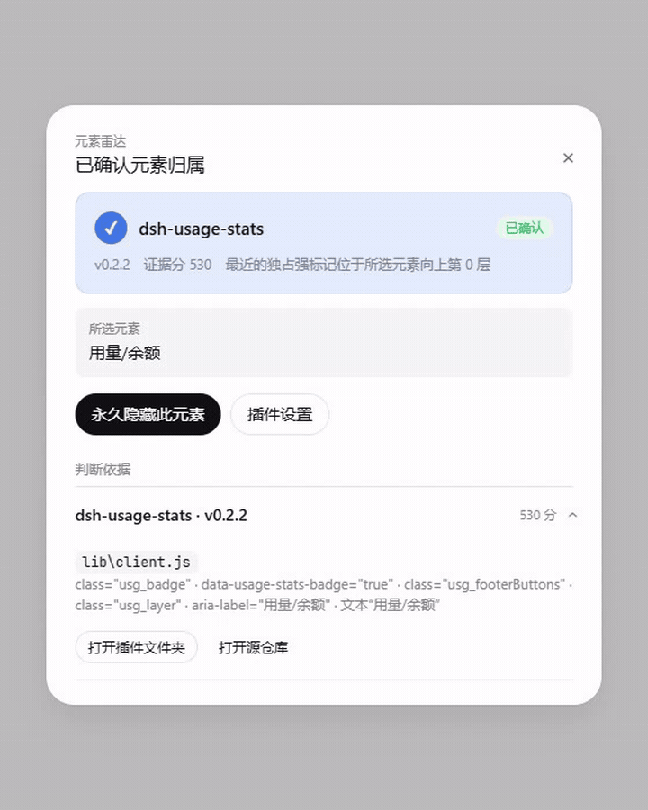
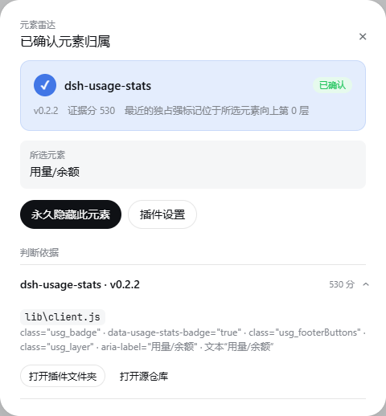
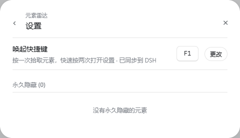

# 元素雷达 (Element Radar)

> 非官方 DeepSeek Harness 社区项目，与 DeepSeek 官方无隶属或背书关系。

按一下 `F1`，点选页面元素，找出它属于哪个已安装插件；也可以永久隐藏不需要的界面元素。



## 功能

- 元素拾取：高亮鼠标下的元素，单击后分析归属。
- 归属判断：只用运行时 DOM 标记、嵌套距离和当前 profile 的运行时代码建立证据，不内置任何第三方插件名单或元信息。
- 定位源码：展示命中的插件版本、源码文件和匹配分。
- 快速打开：直接打开已安装插件文件夹或其 `package.json` 声明的源仓库。
- 元素剪枝：永久隐藏选中元素，并在设置中逐条或全部取消。
- 自定义快捷键：默认 `F1`；快速按两次打开设置，设置页也可重新录入快捷键。
- DSH 原生视觉：使用官方主题 token，支持浅色、深色与窄窗口。

## 界面

识别结果：



设置与隐藏规则：



## 兼容性

- DeepSeek Harness：`>=0.1.0-rc.8 <0.2.0-0`
- Desktop：anywhere-labs `2.0.1-rc8.1` 已验证
- 操作系统：Windows、Linux、macOS
- 安装布局：npm/pnpm 普通安装、tgz、`file:`、`link:`、源码目录链接与 npm workspace 提升

运行时直接使用 DSH 提供的 `ctx.baseUrl` 定位当前 profile，并沿 Node 标准模块搜索路径解析插件。它不猜测用户名、用户目录、盘符、Desktop 数据目录或进程工作目录，因此安装位置和启动方式不会改变识别结果。

## 安装

推荐通过 DSH 官方插件命令安装发布包；该命令会安装依赖并自动维护 profile 的 bundle 列表：

```sh
dsh plugin --profile web add ./dsh-element-inspector-0.4.0.tgz
```

从源码目录开发时可以直接建立链接：

```sh
dsh plugin --profile web add link:.
```

也可以在目标 DSH profile 目录中使用 npm 或 pnpm：

```sh
npm install ./dsh-element-inspector-0.4.0.tgz
# 或
pnpm add ./dsh-element-inspector-0.4.0.tgz
```

直接使用 npm/pnpm 时，确认 `dsh.profile.bundles` 包含插件名：

```json
{
  "dsh": {
    "profile": {
      "bundles": ["dsh-element-inspector"]
    }
  }
}
```

重启对应 DSH Web/Desktop 实例后按 `F1` 使用。

## 使用

1. 按一次快捷键进入拾取模式。
2. 移动鼠标预览目标范围，单击确认元素；按 `Esc` 可退出。
3. 查看首选插件和折叠的判断依据。
4. 按“打开插件文件夹”“打开源仓库”或“永久隐藏此元素”。
5. 快速按两次快捷键进入设置，管理快捷键和隐藏规则。

## 禁用与卸载

禁用时，从 `dsh.profile.bundles` 移除 `dsh-element-inspector` 并重启。卸载时再从 profile dependencies 中移除包。插件不会修改会话、凭据或其他插件数据。

隐藏规则和快捷键保存在 DSH 官方设置文件的独立命名空间：

```text
dsh-element-inspector
```

卸载前可在插件设置中“全部取消隐藏”。

## 权限与隐私

- 本地读取：只扫描当前 DSH profile 的 `dependencies` 中已安装插件的文本源码，用于匹配归属。
- 本地打开：只允许打开 profile 中已安装插件的真实目录；Windows 使用系统文件管理器，macOS 使用 Launch Services，Linux 使用 XDG/GIO。源仓库来自该插件的 `package.json`。
- 本地存储：快捷键和隐藏规则通过 DSH 官方 `settingsScope` 写入 Host 设置文档；旧版浏览器配置只做一次性迁移。
- 网络：插件不上传元素、源码、会话或凭据。点击“打开源仓库”后，系统浏览器会访问相应 URL。
- API Key：不需要。

详细披露也包含在 `package.json` 的 `disclosure` 字段中。

## DSH 集成

Host 入口 `index.js` 注册本机分析/打开路由，并通过 `dsh-settings` 注册持久化 schema。Web 入口通过官方 `settingsScope` 同步快捷键和隐藏规则。Host 从 DSH `ctx.baseUrl` 获取 profile，以 Node 模块解析规则兼容不同包管理器和链接安装；接口包均声明在 `peerDependencies`，不会把 DSH runtime 打进插件包。

## 市场提交

仓库根目录包含 `package.json` 的 `dsh` 字段和 `dsh-plugin.json`。`marketplace/` 提供 dsh.pub、Awesome DSH Plugins 和 DeepSeek Harness Discussion #2004 的提交模板；这些文件不代表项目已经被相应市场收录。

发布仓库时还需添加 GitHub topic：`dsh-plugin`。

## License

[MIT](LICENSE)
