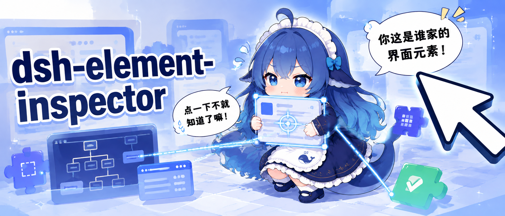
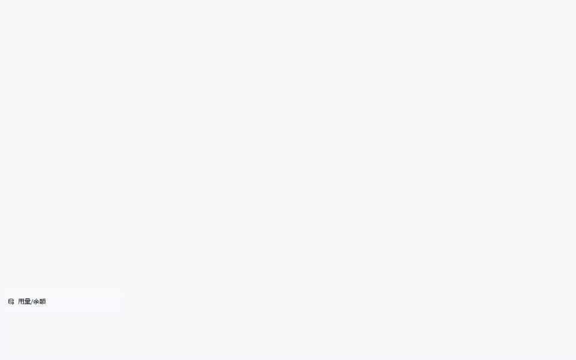
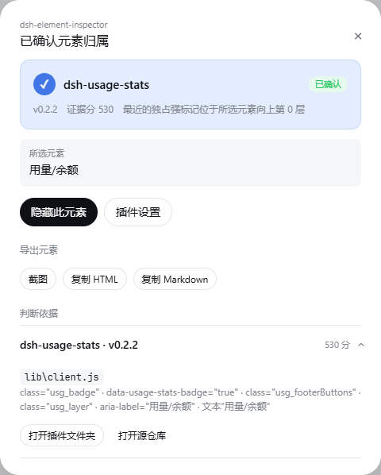
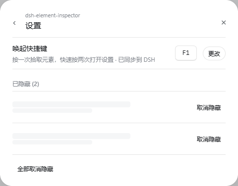

# dsh-element-inspector

English | [简体中文](README.zh.md)



Inspect a [DeepSeek Harness](https://github.com/deepseek-ai/deepseek-harness) UI element, identify whether it belongs to the DSH interface or an installed plugin, and export or hide the selection.

> [!NOTE]
> This is an unofficial community project. It is not affiliated with or endorsed by DeepSeek.

> [!IMPORTANT]
> Attribution comes from a local evidence-scoring detection algorithm, not an authoritative ownership statement from DSH or a plugin. “Confirmed” only means that the current evidence crossed the algorithm's threshold. It is not an absolute guarantee and does not establish that a plugin is trustworthy, safe, or signed by a particular author.

Press `F1`, point at an element, and click to inspect it. The plugin compares stable DOM markers with the client bundles DSH is actually serving to the current page, then presents the strongest matches and their supporting evidence.



## Features

- **Element picker**: highlights the element under the pointer and inspects it on click.
- **Evidence-based attribution**: distinguishes the DSH interface from installed plugins using DOM markers, ancestor distance, and source-code matches. Only DSH identity is built in; there is no plugin catalog.
- **Source discovery**: shows matching owners, versions, source files, and evidence for each result.
- **Quick navigation**: opens an installed plugin directory or the source repository declared in its `package.json`.
- **Element export**: captures a local PNG screenshot, copies `outerHTML`, or converts the selection to GitHub Flavored Markdown.
- **Persistent hiding**: hides selected elements and lets you restore individual elements or clear all hiding rules.
- **Configurable shortcut**: uses `F1` by default; press it twice quickly for the compact settings dialog, or manage the shortcut and hidden rules under Settings → Plugin configuration.

## Screenshots

| Attribution result | Settings and hidden-element rules |
| --- | --- |
|  |  |

## Compatibility

| Component | Supported versions or platforms |
| --- | --- |
| DeepSeek Harness | `>=0.1.0-rc.8 <0.2.0-0` |
| DSH platforms | Web and Desktop |
| Operating systems | Windows, Linux, and macOS |

The plugin treats the DSH Host's `clientModules.graph()` and `clientPath()` as the runtime source of truth. Regular npm/pnpm installs, local links, workspace-hoisted packages, and dynamic Loader Web plugins therefore follow DSH's actual composition without assuming a fixed user directory, drive letter, Desktop data directory, or process working directory.

## Installation

An existing DeepSeek Harness installation is required. Install the prebuilt package from npm into the `web` profile:

```sh
dsh plugin --profile web add dsh-element-inspector
```

No install-time build permission is required. Restart the corresponding DSH Web or Desktop instance after installation. You can inspect the composed profile before starting it:

```sh
dsh --profile web --dump-config
dsh web
```

To install the source snapshot for this release directly from GitHub instead:

```sh
dsh plugin --profile web add github:muyuanjin/dsh-element-inspector#v0.6.0
```

The repository includes the built runtime entry points, so this installation also requires no install-time build script.

### Local Checkout

To develop from a local checkout:

```sh
git clone https://github.com/muyuanjin/dsh-element-inspector.git
cd dsh-element-inspector
pnpm install
pnpm run build
dsh plugin --profile web add .
```

The profile remains linked to the checkout. Rebuild the browser bundle and restart DSH after changing client code.

## Usage

1. Press the configured shortcut once to enter selection mode.
2. Move the pointer to preview an element, then click to inspect it. Press `Esc` to cancel.
3. Review the preferred owner and expand the evidence for other candidates.
4. Capture a screenshot, copy HTML or Markdown, open a matched plugin's location, or hide the element.
5. Press the shortcut twice quickly, or open Settings → Plugin configuration, to change the shortcut or manage hidden-element rules.

Screenshots are copied to the system clipboard when the browser allows image writes; otherwise, they are downloaded as PNG files. HTML and Markdown are copied to the clipboard. All capture and conversion work happens locally.

## How Attribution Works

The client collects stable signals from the selected element and up to seven ancestors, including IDs, classes, `data-*` attributes, ARIA labels, text, and React owner names. For controls projected by the DSH shell, such as settings navigation rows, the algorithm also connects React keys/components to current Cordis slot registrations and matches the registered component's function source. The Host accepts only Web entries in the current `clientModules.graph()` and scans only the served bundle returned by `clientPath(id)`; it does not guess package entry points or scan conventional CSS locations.

Official DSH packages are grouped into one host candidate using built-in DSH identity metadata; other active runtime modules remain separate plugin candidates. The authoritative server graph automatically excludes disabled, Host-only, unloaded, and inspector-self entries. Opening a plugin directory or repository revalidates the current graph, bundle path, and manifest package name instead of reusing authorization from an earlier inspection. Runtime registration source, unique stable markers, and nearer ownership boundaries receive more weight. Shared, generated, or generic markers are discounted. A result is marked as confirmed only for exclusive runtime registration source, an exclusive stable ID/test marker, or multiple independent exclusive markers. A distant DSH wrapper alone is not enough to classify the selected child as official; insufficient evidence remains a candidate or produces no attribution.

## Detection Limitations

- This is heuristic attribution, not code signing, call-chain tracing, or an official DSH audit API. A confirmed result can still choose the wrong layer when plugins wrap, rewrite, or jointly compose a control.
- Only modules in DSH's current client graph whose bundle maps to a same-named local package manifest are compared. Unloaded, disabled, Host-only, remote, and dynamic code that has a slot registration but no mapped client-module entry do not become package candidates.
- An actual served client bundle larger than 1 MB is skipped. Source caching invalidates on DSH graph and entry revisions; overwriting a file outside DSH HMR without changing its revision can still retain cached source until the graph changes or the Host restarts.
- Attribution for shell-projected controls depends on the current DSH slots inspection API and React fiber/key structure. A DSH or React upgrade can break this evidence path, causing results to fall back to DOM/source markers and degrade from confirmed to candidate or unknown.
- Text, classes, `data-*` names, and function source can be reused or copied across plugins. The algorithm retains competing candidates where possible, but cannot infer the real author without exclusive evidence.
- Iframes, closed shadow roots, canvas-drawn content, and CSS pseudo-elements are not ordinary selectable DOM nodes for this inspector. Usually only their outer container can be inspected, if anything.
- “DSH interface” is grouped by built-in DSH package-name identity rules, not publisher-signature verification. A local or nonstandard source impersonating that namespace can be grouped into the official candidate.
- Results describe the current page, profile, and activation state only. Switching profiles, enabling or disabling plugins, upgrading packages, or rebuilding bundles can change candidates and scores for the same visual element.

## Privacy and Permissions

- Reads only actual served bundles for entries in the DSH Host's current client module graph. Disabled, unloaded, and Host-only entries are excluded.
- Identification, folder opening, and repository opening use DSH Connection's loopback-only RPC and inherit its Host, Origin, cross-site, JSON media-type, and streaming body-size fences.
- Opens verified installed-plugin directories with the operating system file manager. Repository URLs come from the installed plugin's `package.json`.
- Writes exported HTML, Markdown, or PNG data to the clipboard, with a local PNG download as the screenshot fallback.
- Stores the shortcut and hiding rules through the official DSH settings service and keeps a browser-local startup cache. Legacy browser settings are migrated once when possible.
- Does not upload inspected elements, source files, screenshots, conversations, or credentials. Opening a source repository launches its URL in the system browser.
- Requires no API keys.

See the `disclosure` field in [`package.json`](package.json) for the package-level permission declaration. To report a vulnerability, follow the [security policy](SECURITY.md).

## Updating and Uninstalling

To update an npm installation and restart DSH:

```sh
dsh plugin --profile web update --latest dsh-element-inspector
```

For a GitHub installation, install the desired release tag with the corresponding `github:` command.

To uninstall the plugin and remove its bundle layer from the profile:

```sh
dsh plugin --profile web remove dsh-element-inspector
```

The plugin does not modify conversations, credentials, or other plugin data. Before uninstalling, you can open its settings and clear all hidden-element rules.

## Development

The host entry point is [`index.js`](index.js). Browser code lives in [`src/client.js`](src/client.js) and is bundled to [`client.js`](client.js).

```sh
pnpm run test
pnpm run build
```

The test suite covers attribution scoring, authoritative client-module discovery, a real Cordis + Connection route composition and its trust fences, portable package resolution, the settings contract, hiding rules, and element export helpers. The build command regenerates the browser bundle with esbuild.

## License

Licensed under the [MIT License](LICENSE).
